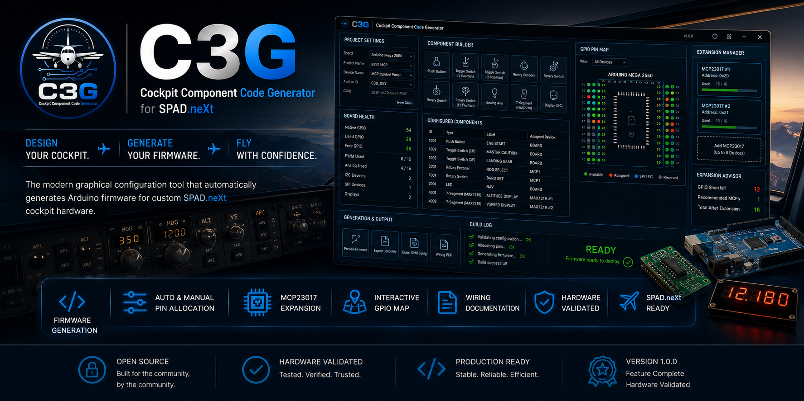
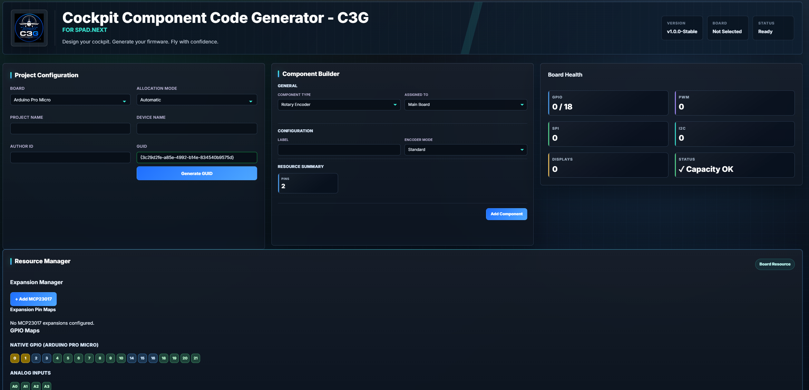
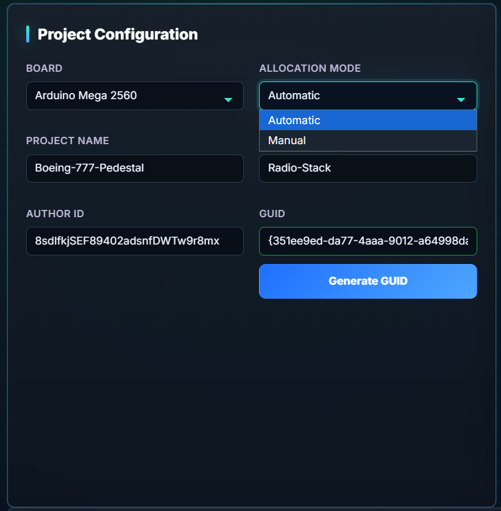
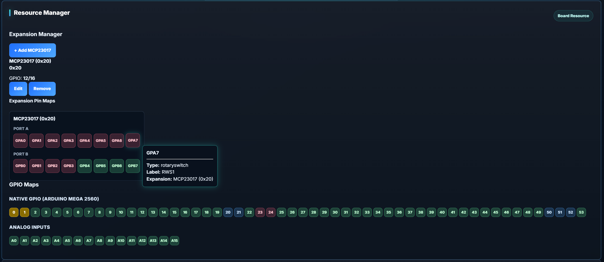
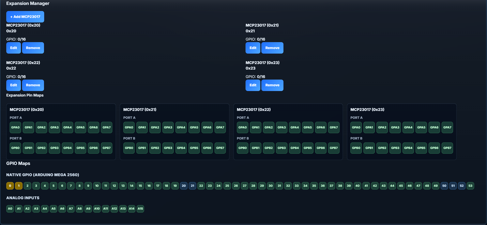
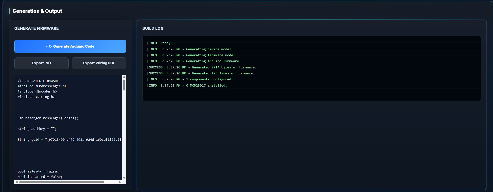

<p align="center">
    
</p>

<h1 align="center">
C3G
</h1>

<h3 align="center">
Cockpit Component Code Generator
</h3>

<p align="center">

<b>Design your cockpit.</b><br>
<b>Generate your firmware.</b><br>
<b>Fly with confidence.</b>

</p>

<p align="center">

A visual firmware generation toolkit for SPAD.neXt-compatible cockpit hardware.

</p>

<p align="center">

<!-- GitHub badges will be added after the first public release -->

🚀 **Version 1.0.0** &nbsp;&nbsp;|&nbsp;&nbsp; **Stable Release** &nbsp;&nbsp;|&nbsp;&nbsp; **Hardware Validated** &nbsp;&nbsp;|&nbsp;&nbsp; **Open Source**

</p>

---

# Build Cockpits. Not Firmware.

Creating custom cockpit hardware should be exciting—not frustrating.

Traditionally, building a SPAD.neXt-compatible Arduino device means writing firmware, planning GPIO assignments, preventing pin conflicts, configuring expansion hardware, and debugging code before you can even test your first switch.

**C3G changes that.**

Instead of writing Arduino code, C3G lets you design your cockpit visually, intelligently allocate hardware resources, and generate production-ready firmware through a modern graphical interface.

Whether you're building a simple radio panel or a full-scale home cockpit, C3G removes the repetitive engineering work so you can focus on designing, building, and flying.

---

# Why C3G?

C3G was created with one goal:

> **Make professional cockpit development accessible to every flight simulator builder.**

The project combines hardware planning, automatic firmware generation, resource management, wiring documentation, and hardware validation into a single streamlined workflow.

Rather than spending hours solving engineering problems, builders can concentrate on creating immersive cockpit experiences.

---

# Engineering Principles

Every feature in C3G follows the same philosophy.

## 🛡 Reliability First

Every supported component and feature is validated on real hardware before becoming part of a production release.

---

## ⚙ Automation Where It Matters

Repetitive engineering tasks should be handled by software—not by the user.

Automatic pin allocation, conflict prevention, and firmware generation allow builders to move faster with greater confidence.

---

## 🎯 Visual by Design

C3G replaces manual firmware development with an intuitive graphical interface that keeps the focus on cockpit design rather than source code.

---

## 🔒 Safe by Default

Resource conflicts are detected before firmware is generated, helping prevent common wiring and GPIO assignment mistakes.

---

## 🌍 Built for the Community

C3G is an open-source project created for the SPAD.neXt and flight simulation communities.

Community feedback, testing, and contributions help shape every future release.

---

# Why Builders Choose C3G

|     |                                         |
| :-- | :-------------------------------------- |
| ⚡  | Generate Arduino firmware automatically |
| 🎯  | Automatic & Manual GPIO allocation      |
| 🗺  | Interactive GPIO Pin Map                |
| 📊  | Real-time Board Health Dashboard        |
| 🔌  | MCP23017 Expansion Support              |
| 💡  | MAX7219 Seven Segment Displays          |
| 🖥  | I²C Display Support                     |
| 📄  | Automatic Wiring Documentation          |
| ✅  | Hardware Validated                      |
| 🌍  | Completely Open Source                  |

---

# Designed for Real Cockpits

C3G is not a proof of concept or a collection of code snippets.

Version **1.0.0** represents a stable, hardware-validated release developed through continuous testing and refinement.

Every supported feature has been designed with practical cockpit building in mind, with an emphasis on reliability, maintainability, and ease of use.

Whether your project consists of a handful of switches or a fully featured simulator cockpit, C3G provides a dependable foundation for firmware generation and hardware configuration.

<br>

# Feature Highlights

C3G combines intelligent hardware planning with automatic firmware generation to provide a complete workflow for building SPAD.neXt-compatible cockpit hardware.

Unlike traditional Arduino development, C3G manages hardware resources, validates configurations, and generates production-ready firmware through a visual interface.

| Feature                              | Description                                                                                                                                        |
| ------------------------------------ | -------------------------------------------------------------------------------------------------------------------------------------------------- |
| ⚡ Automatic Firmware Generation     | Generate clean, production-ready Arduino firmware with a single click.                                                                             |
| 🎯 Automatic & Manual Pin Allocation | Choose automatic GPIO allocation or manually assign pins for complete control.                                                                     |
| 🗺 Interactive GPIO Pin Map          | Visualize every GPIO assignment with real-time synchronization between components and board resources.                                             |
| 📊 Board Health Dashboard            | Monitor available GPIO, PWM, Analog, SPI, and I²C resources as your project grows.                                                                 |
| 🔌 MCP23017 Expansion Support        | Expand digital inputs and outputs using intelligent GPIO expansion management.                                                                     |
| 💡 MAX7219 Display Support           | Configure multiple seven-segment displays with daisy-chain support, decimal points, brightness control, reverse digit order, and zero suppression. |
| 🖥 I²C Display Support               | Configure supported I²C displays without manual firmware coding.                                                                                   |
| 📄 Wiring Documentation              | Automatically generate organized wiring documentation for your cockpit build.                                                                      |
| 👀 Firmware Preview                  | Review generated firmware before exporting to your Arduino.                                                                                        |
| ✅ Hardware Validated                | Every supported component has been tested on physical hardware before release.                                                                     |

---

# Supported Arduino Boards

C3G currently supports the following Arduino platforms:

| Board                      | Status |
| -------------------------- | :----: |
| Arduino Mega 2560          |   ✅   |
| Arduino Mega 2560 Pro Mini |   ✅   |
| Arduino Pro Micro          |   ✅   |

Additional boards may be introduced in future releases.

---

# Supported Components

C3G currently supports the following cockpit components.

### Digital Inputs

- Push Buttons
- Toggle Switches (2 Position)
- Toggle Switches (3 Position)
- Rotary Encoders
- Rotary Switches

### Analog Inputs

- Analog Axes

### Outputs

- LEDs
- MAX7219 Seven Segment Displays
- I²C Displays

### Expansion Hardware

- MCP23017 GPIO Expanders

---

# Typical Workflow

From idea to working cockpit hardware in just a few steps.

```text
Choose a Board
        │
        ▼
Configure Components
        │
        ▼
Allocate GPIO Resources
        │
        ▼
Review Interactive GPIO Map
        │
        ▼
Generate Arduino Firmware
        │
        ▼
Upload to Arduino
        │
        ▼
Connect to SPAD.neXt
        │
        ▼
FLY
```

---

# Application Tour

## Dashboard

_The central workspace providing a complete overview of your cockpit project._



---

## Component Builder

_Configure supported cockpit hardware through an intuitive graphical interface._



---

## Interactive GPIO Pin Map

_Visualize every assigned pin before firmware generation._



---

## Expansion Manager

_Scale your cockpit with intelligent MCP23017 expansion management._



---

## Firmware Preview

_Inspect production-ready Arduino firmware before exporting._



---

## Wiring Documentation

_Generate organized wiring documentation to simplify cockpit assembly._


---

# Installation

## Download

Download the latest stable release from the GitHub Releases page.

> **Recommended:** Always use the latest stable release unless you specifically need an earlier version.

---

## Requirements

- Windows 10 / Windows 11
- Arduino IDE 2.x (or newer)
- Supported Arduino Board
    - Arduino Mega 2560
    - Arduino Mega 2560 Pro Mini
    - Arduino Pro Micro
- SPAD.neXt

---

# Quick Start

Getting started with C3G takes only a few minutes.

1. Launch **C3G**.
2. Create a new project.
3. Select your Arduino board.
4. Add cockpit components.
5. Allocate GPIO pins automatically or manually.
6. Review the Interactive GPIO Pin Map.
7. Generate the firmware.
8. Upload the firmware using the Arduino IDE.
9. Connect your hardware to SPAD.neXt.
10. Start flying.

---

# Building from Source

C3G is an open-source project.

Clone the repository:

```bash
git clone https://github.com/<YOUR_USERNAME>/cockpit-component-code-generator.git
```

Open the project folder and launch `index.html` in your preferred development environment.

---

# Project Philosophy

C3G follows one guiding principle:

> **Reliability before features.**

Every feature is designed, implemented, and validated on real hardware before becoming part of a production release.

The objective is not to support the largest number of devices.

The objective is to provide cockpit builders with a dependable engineering toolkit they can trust.

<br>

# Roadmap

Version **1.0.0** is the first stable public release.

Future development may include:

- Additional Arduino boards
- Additional display technologies
- Enhanced wiring documentation
- Improved project templates
- Additional cockpit components
- Plugin architecture
- Localization

Future features will continue to follow the same philosophy:

**Stability first.**

---

# Contributing

Contributions are welcome.

Whether you're reporting bugs, suggesting improvements, improving documentation, testing hardware, or contributing code, every contribution helps make C3G better for the entire flight simulation community.

If you'd like to contribute:

- Report bugs with detailed reproduction steps.
- Suggest new features through GitHub Issues.
- Submit pull requests for improvements.
- Help improve the documentation.
- Share your cockpit builds and feedback.

---

# Support

If you encounter a problem:

- Search existing GitHub Issues.
- Open a new Issue if the problem has not already been reported.
- Include screenshots, logs, and reproduction steps whenever possible.

---

# License

This project is released under the **MIT License**.

See the `LICENSE` file for details.

---

# Acknowledgements

C3G would not exist without the inspiration, testing, and feedback provided by the flight simulation community.

Special thanks to:

- The SPAD.neXt community
- Hardware testers
- Early adopters
- Everyone who shared ideas, bug reports, and feature suggestions throughout development

Your feedback has helped shape C3G into the project it is today.

---

# About the Author

**Perur Chandramouli**

Creator and maintainer of **C3G – Cockpit Component Code Generator**.

Built with a passion for flight simulation, electronics, and open-source software.

---

<p align="center">

## C3G

### Cockpit Component Code Generator

**Design your cockpit.**

**Generate your firmware.**

**Fly with confidence.**

---

⭐ If C3G helps you build your cockpit, consider starring the repository to support future development.

</p>
